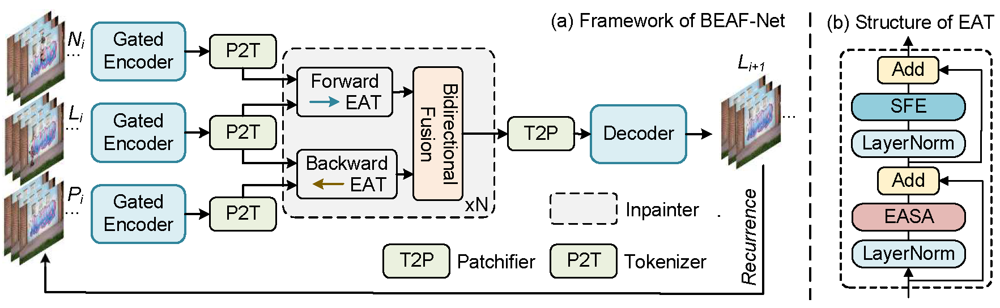

# Bidirectional Error-Aware Fusion Network 

### ⚡ Highlights:
Our propose model has the following *merits* that others have not:
- **Memorize the Past**: Our method bidirectionally incorporates both past inpainted frames and forward reference frames to make the current generation become more temporally-consistent.
- **Distinguish the Reality**: Our method exploits mask priors for video inpainting to mark each token when calculating correlation in self-attention, which allows the model to distinguish different tokens according to their sources so as to guide the model to produce more faithful results.

## Demo
We place several examples below (click for details):

<table>
<tr>
   <td> 
      
 
      
 
      <strong>Dance (Object removal)</strong>
      
 
      
      

   </td>
   <td> 
      
 
      
 
      <strong>Hokey (Object removal)</strong>
      
 
      
      

   </td>
   <td> 
      
 
      
 
      <strong>Motor (Object removal)</strong>
      
 
      
      

   </td>
</tr>
<td> 
      
 
      
 
      <strong>Parkour (Object removal)</strong>
      
 
      
      

   </td>
   <td> 
      
 
      
 
      <strong>Swing (Object removal)</strong>
      
 
      
      

   </td>
   <td> 
      
 
      
 
      <strong>Tennis (Object removal)</strong>
      
 
      
      

   </td>
</tr>
<td> 
      
 
      
 
      <strong>Bumps (Corruption restoration)</strong>
      
 
      
      

   </td>
   <td> 
      
 
      
 
      <strong>Car (Corruption restoration)</strong>
      
 
      
      

   </td>
   <td> 
      
 
      
 
      <strong>Breakflare (Corruption restoration)</strong>
      
 
      
      

   </td>
</tr>
<td> 
      
 
      
 
      <strong>Bus (Dis-occlusion)</strong>
      
 
      
      

   </td>
   <td> 
      
 
      
 
      <strong>Surf (Dis-occlusion)</strong>
      
 
      
      

   </td>
   <td> 
      
 
      
 
      <strong>Fly (Dis-occlusion)</strong>
      
 
      
      

   </td>
</tr>
</table>

More demo videos are going to uploaded...

## Reference
We acknowledge the following works for their open source: 
[1] ProPainter: Improving Propagation and Transformer for Video Inpainting, Zhou et al., In ICCV 2023. 
[2] Towards End-to-End Flow-Guided Video Inpainting, Li et al., In CVPR 2022. 
[3] Fusing Fine-grained Information in Transformers for Video Inpainting, Liu et al., In ICCV 2021. 
[4] Learning Joint Spatio-Temporal Transformations for Video Inpainting, Zeng et al., In ECCV 2020. 
  